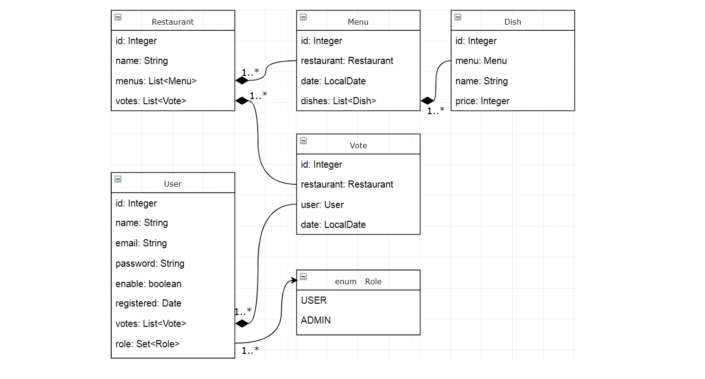

## Выпускной проект
Design and implement a REST API using Hibernate/Spring/SpringMVC **without frontend**.

The task is:

Build a voting system for deciding where to have lunch.

 * 2 types of users: admin and regular users
 * Admin can input a restaurant and it's lunch menu of the day (2-5 items usually, just a dish name and price)
 * Menu changes each day (admins do the updates)
 * Users can vote on which restaurant they want to have lunch at
 * Only one vote counted per user
 * If user votes again the same day:
    - If it is before 11:00 we asume that he changed his mind.
    - If it is after 11:00 then it is too late, vote can't be changed

Each restaurant provides new menu each day.

## Запуск
Для запуска приложения необходимо ввести в консоли 
```html
mvn clean package -DskipTests=true org.codehaus.cargo:cargo-maven2-plugin:1.7.7:run
```
Приложение будет доступно по url: `http://localhost:8080/menuvoting`

## Описание
Ниже приведено схематическое представление структуры приложения.



Пользоваться приложением могут только авторизованные пользователи (реализована регистрация).    
Пользователи с ролью “User” имеют возможность проголосовать за ресторан (меню предоставленное рестораном), а также просматривать свои прошлые голоса.     
Пользователи с ролью “Admin” имеют возможность управлять (создание, чтение, обновление, удаление) сущностями User, Restaurant, Menu, Dish.  

## Примеры CURL запросов
### Незарегистрированный пользователь
Register user: `curl -s -X POST -d '{"name":"newName","email":"newemail@ya.ru","password":"newPassword"}' -H 'Content-Type:application/json;charset=UTF-8' http://localhost:8080/menuvoting/rest/profile/register`
### Пользователь с ролью "User"
#### User
Get yourself: `curl -s http://localhost:8080/menuvoting/rest/profile  --user user@yandex.ru:password`    
Update yourself: `curl -s -X PUT -d '{"name":"New777","email":"user@yandex.ru","password":"passwordNew"}' -H 'Content-Type: application/json' http://localhost:8080/menuvoting/rest/profile --user user@yandex.ru:password`  
Delete yourself: `curl -s -X DELETE http://localhost:8080/menuvoting/rest/profile --user user@yandex.ru:password`
#### Restaurant
Get all: `curl -s http://localhost:8080/menuvoting/rest/restaurants --user user@yandex.ru:password`     
Get id=100003: `curl -s http://localhost:8080/menuvoting/rest/restaurants/100003  --user user@yandex.ru:password`   
Get by name "Ресторан 1": `curl -s http://localhost:8080/menuvoting/rest/restaurants/by?name=%D0%A0%D0%B5%D1%81%D1%82%D0%BE%D1%80%D0%B0%D0%BD%201 --user user@yandex.ru:password`   
Get all with votes: `curl -s http://localhost:8080/menuvoting/rest/restaurants/result --user user@yandex.ru:password`
#### Menu
Get menus for voting: `curl -s http://localhost:8080/menuvoting/rest/menus --user user@yandex.ru:password`
#### Vote
Get all: `curl -s http://localhost:8080/menuvoting/rest/profile/votes --user user@yandex.ru:password`     
Create vote for restaurant id=100004: `curl -s -X POST -d '{}' -H 'Content-Type:application/json;charset=UTF-8' http://localhost:8080/menuvoting/rest/profile/votes?restaurantId=100004  --user user2@gmail.com:password2`      
Get id=100016: `curl -s http://localhost:8080/menuvoting/rest/profile/votes/100016  --user user@yandex.ru:password`   
Update id=100016: `curl -s -X PUT -d '{}' -H 'Content-Type: application/json' http://localhost:8080/menuvoting/rest/profile/votes/100016?restaurantId=100004 --user user@yandex.ru:password`
### Пользователь с ролью "Admin"
#### User
Get all: `curl -s http://localhost:8080/menuvoting/rest/admin/users --user admin@gmail.com:admin`     
Create: `curl -s -X POST -d '{"name":"New2","email":"new2@yandex.ru","password":"passwordNew","roles":["ROLE_USER"]}' -H 'Content-Type:application/json;charset=UTF-8' http://localhost:8080/menuvoting/rest/admin/users --user admin@gmail.com:admin`     
Get id=100000: `curl -s http://localhost:8080/menuvoting/rest/admin/users/100000 --user admin@gmail.com:admin`    
Update id=100000: `curl -s -X PUT -d '{"name":"UserUpdated","email":"user@yandex.ru","password":"passwordNew","roles":["ROLE_USER"]}' -H 'Content-Type: application/json' http://localhost:8080/menuvoting/rest/admin/users/100000 --user admin@gmail.com:admin`  
Delete id=100000: `curl -s -X DELETE http://localhost:8080/menuvoting/rest/admin/users/100000 --user admin@gmail.com:admin` 
Disable id=100000: `curl -s -X PATCH http://localhost:8080/menuvoting/rest/admin/users/100000?enabled=false --user admin@gmail.com:admin`     
Get by email "user2@gmail.com": `curl -s http://localhost:8080/menuvoting/rest/admin/users/by?email=user2@gmail.com --user admin@gmail.com:admin`
#### Restaurant
Create: `curl -s -X POST -d '{"name":"New restaurant"}' -H 'Content-Type:application/json;charset=UTF-8' http://localhost:8080/menuvoting/rest/admin/restaurants --user admin@gmail.com:admin`  
Update id=100003: `curl -s -X PUT -d '{"name":"Update restaurant"}' -H 'Content-Type: application/json' http://localhost:8080/menuvoting/rest/admin/restaurants/100003 --user admin@gmail.com:admin`    
Delete id=100003: `curl -s -X DELETE http://localhost:8080/menuvoting/rest/admin/restaurants/100003 --user admin@gmail.com:admin` 
#### Menu
Get all for restaurant 100004: `curl -s http://localhost:8080/menuvoting/rest/admin/menus?restaurantId=100004 --user admin@gmail.com:admin`     
Create for restaurant 100004: `curl -s -X POST -d '{"date":"2020-01-05"}' -H 'Content-Type:application/json;charset=UTF-8' http://localhost:8080/menuvoting/rest/admin/menus?restaurantId=100004 --user admin@gmail.com:admin`     
Get id=100007 for restaurant 100004: `curl -s http://localhost:8080/menuvoting/rest/admin/menus/100007?restaurantId=100004 --user admin@gmail.com:admin`     
Update id=100007 for restaurant 100004: `curl -s -X PUT -d '{"date":"2020-01-05"}' -H 'Content-Type: application/json' http://localhost:8080/menuvoting/rest/admin/menus/100007?restaurantId=100004 --user admin@gmail.com:admin`    
Delete id=100007 for restaurant 100004: `curl -s -X DELETE http://localhost:8080/menuvoting/rest/admin/menus/100007?restaurantId=100004 --user admin@gmail.com:admin`    
Get by date for restaurant 100004: `curl -s 'http://localhost:8080/menuvoting/rest/admin/menus/by?restaurantId=100004&date=2020-01-05' --user admin@gmail.com:admin`     
#### Dish
Get all for menu 100006: `curl -s http://localhost:8080/menuvoting/rest/admin/dishes?menuId=100006 --user admin@gmail.com:admin`     
Create for menu 100006: `curl -s -X POST -d '{"name":"New dish","price":300}' -H 'Content-Type:application/json;charset=UTF-8' http://localhost:8080/menuvoting/rest/admin/dishes?menuId=100006 --user admin@gmail.com:admin`     
Get id=100011 for menu 100006: `curl -s http://localhost:8080/menuvoting/rest/admin/dishes/100011?menuId=100006 --user admin@gmail.com:admin`     
Update id=100011 for menu 100006: `curl -s -X PUT -d '{"name":"Updated dish","price":400}' -H 'Content-Type: application/json' http://localhost:8080/menuvoting/rest/admin/dishes/100011?menuId=100006 --user admin@gmail.com:admin`    
Delete id=100011 for menu 100006: `curl -s -X DELETE http://localhost:8080/menuvoting/rest/admin/dishes/100011?menuId=100006 --user admin@gmail.com:admin`    
